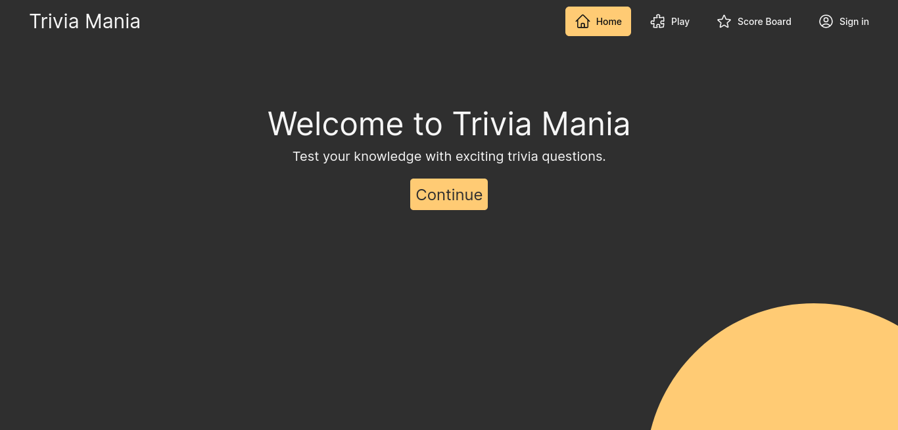
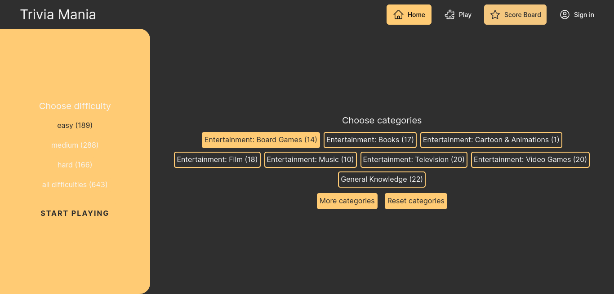
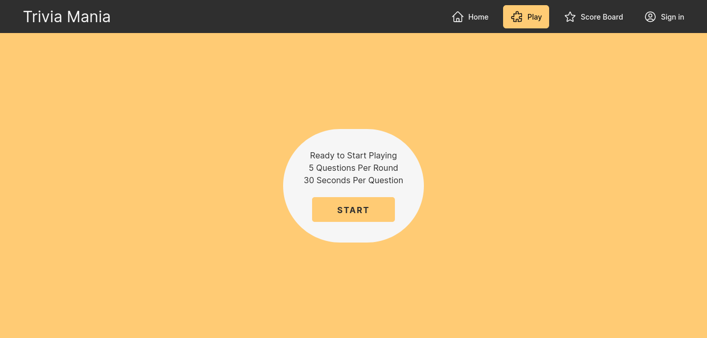
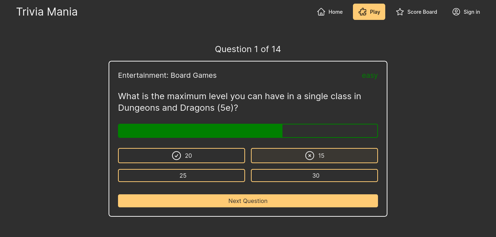

[](https://choosealicense.com/licenses/mit/)
<h1 align="center" id="title">Trivia Mania</h1>

<p align="center"></p>

<p id="description">Are you ready to take your trivia skills to the next level? Trivia Mania is the ultimate destination for those seeking an engaging and dynamic experience. With a wide array of trivia questions on various topics our platform offers something for everyone. Our immersive and responsive gaming environment powered by cutting-edge technology will keep you on the edge of your seat. Join us on a journey of personal growth and achievement as you challenge your brainpower with our carefully curated questions.</p>


<h2>💼 Tech Stack<h2>

<div style="display: flex; gap: 2rem; flex-wrap: wrap; justify-content: center; align-items: center;">
  <a href="https://www.typescriptlang.org/" alt="Typescript homepage">
    
  </a>

  <a href="https://nextjs.org/" alt="Nextjs homepage">
    
  </a>

  <a href="https://headlessui.com/" alt="Headless UI homepage">
    
  </a>

  <a href="https://clerk.com/" alt="Clerk.js homepage">
    
  </a>

  <a href="https://www.framer.com/motion/" alt="Framer Motion homepage">
    
  </a>

  <a href="https://jestjs.io/" alt="Jest.js homepage">
    
  </a>

  <a href="https://nodejs.org/" alt="Node.js homepage">
    
  </a>

  <a href="https://mui.com/material-ui/" alt="Material UI homepage">
    
  </a>

  <a href="https://tailwindcss.com/" alt="Tailwind CSS homepage">
    
  </a>

  <a href="https://axios-http.com/docs/intro" alt="Axios.js homepage">
    
  </a>

  <a href="https://tanstack.com/query/v3/" alt="React Query homepage">
    
  </a>

  <a href="https://testing-library.com/docs/react-testing-library/intro/" alt="React Testing Library homepage">
    
  </a>

  <a href="https://styled-components.com/" alt="Styled Components homepage">
    
  </a>
</div>


<h2>🚀 Demo</h2>

[Live Demo](https://lnkd.in/e5rEwWfE)


<h2>🧐 Features</h2>

Here're some of the project's best features:

*   Unique Questions: Enjoy a wide range of trivia questions carefully selected to ensure you always have fresh challenges.
*   LocalStorage Integration: Save your preferences and progress making your experience tailored to your choices.
*   Clean and Responsive UI: Experience a visually appealing and user-friendly interface with smooth animations and transitions.
*   User Stats and Progress: Keep track of your performance and progress with detailed statistics and the ability to save your game data.
*   Simplified Data Storage: Well-organized storage structure for efficient data management.
*   Unit Testing: Rigorous testing ensures the project's quality and reliability providing a smooth and secure user experience.
*   Custom Hooks and Modularization: Enhance code reusability and maintainability with custom hooks and modularized components using the Context API.


<h2>🧩 Prerequisites</h2>

Before you begin, ensure you have met the following requirements:

- **Node.js**: Make sure you have Node.js installed. You can download it from [nodejs.org](https://nodejs.org/).

- **npm (Node Package Manager)**: This project relies on npm to manage packages. It's usually included with Node.js. You can check your npm version with the command `npm -v`.

- **A Web Browser**: To interact with the application, you'll need a modern web browser.

- **Text Editor**: You'll need a text editor or code editor to work with the project files. Some popular options include Visual Studio Code, Sublime Text, or Atom.

<h2>🗃️ Pre-fill data</h2>


The root directory includes a module, <strong>fetchData</strong>, for fetching questions from the <em>OpenTriviaDB API</em>. To run it, execute the following commands:

<p>1. Compile the module</p>

```npx tsc fetchData.ts```

<p>2. Run the Javascript file</p>

```node fetchData.js```


<h2>🛠️ Installation Steps:</h2>

<p>1. Clone this repository</p>

```
git clone https://github.com/mdesignscode/trivia_mania.git
```

<p>2. Install dependencies</p>

```
npm install
```

<p>3. Setup environment variables</p>

*   <p>Create a file <strong>.env.local</strong> at the root directory of the project</p>

*   <p>Add the following variables:</p>

        # the base url for the api
        # http://localhost:3000/api/ for local development
        NEXT_PUBLIC_API_BASE_URL=http://localhost:3000/api/

        # create a Clerk.js app on https://dashboard.clerk.com/
        # and paste API keys here
        NEXT_PUBLIC_CLERK_PUBLISHABLE_KEY
        CLERK_SECRET_KEY
        WEBHOOK_SECRET

        # CLERK ROUTING
        NEXT_PUBLIC_CLERK_SIGN_IN_URL=/sign-in
        NEXT_PUBLIC_CLERK_SIGN_UP_URL=/sign-up
        NEXT_PUBLIC_CLERK_AFTER_SIGN_IN_URL=/
        NEXT_PUBLIC_CLERK_AFTER_SIGN_UP_URL=/


<p>4. Start development server</p>

```
npm run dev
```


<h2>🛰️ API Reference</h2>

<h3>Get a list of questions to answer</h3>

```http
  Post /api/questions/play
```

| Parameter    | Type                           | Description                                           |
| :----------- | :----------------------------- | :---------------------------------------------------- |
| `difficulty` | `"easy" or "medium" or "hard"` | **Optional**. `The difficulty to filter questions by` |
| `categories` | `string[]`                     | **Optional**. `The categories to filter questions by` |
| `userId`     | `string`                       | **Optional**. `Get questions unique to a user`        |

<h3>Examples</h3>

<p>An example request<p>

```
curl -X POST localhost:3000/api/questions/play -d '{ "difficulty": "easy", "categories": ["Entertainment: Music", "Science & Nature"] }'
```

<p>An example response</p>

```json
[
  {
    "category": "Entertainment: Music",
    "answers": [
      "Veela",
      "Laura Brehm",
      "Danyka Nadeau",
      "Anna Yvette "
    ],
    "correctAnswer": "Laura Brehm",
    "id": "7c5d7c28-ae35-43e5-aa0e-eab4fde30f10",
    "question": "Who was featured in the song &quot;Words&quot; by Feint? ",
    "difficulty": "easy"
  },
  {
    "category": "Science & Nature",
    "answers": [
      "Jupiter",
      "Mercury",
      "Mars",
      "Venus"
    ],
    "correctAnswer": "Venus",
    "id": "8ab16a46-4f26-44a4-a3a7-af439100d15c",
    "question": "What is the hottest planet in the Solar System?",
    "difficulty": "easy"
  }
]
```


<h3>Get questions stats</h3>

```http
  Post /api/questions/stats
```

| Parameter    | Type           | Description                                    |
| :----------- | :------------- | :--------------------------------------------- |
| `recordType` | `difficulties` | **Required**. `Get difficulties stats`         |
| `userId`     | `string`       | **Optional**. `Get questions unique to a user` |

<em>or</em>

| Parameter    | Type         | Description                                            |
| :----------- | :----------- | :----------------------------------------------------- |
| `recordType` | `categories` | **Required**. `Get categories stats`                   |
| `difficulty` | `string`     | **Optional**. `The difficulty to filter categories by` |
| `userId`     | `string`     | **Optional**. `Get questions unique to a user`         |

<h3>Examples</h3>

<p>An example request<p>

```
curl -X POST localhost:3000/api/questions/stats -d '{ "recordType": "categories" }'
```

<p>An example response</p>

```json
{
  "Entertainment: Video Games": 65,
  "all categories": 643,
  "Politics": 1,
  "Entertainment: Books": 51,
  "Science & Nature": 51,
  "Animals": 2,
  "Science: Mathematics": 1,
  "Entertainment: Film": 55,
  "Geography": 51,
  "Entertainment: Music": 54,
  "Vehicles": 2,
  "Entertainment: Cartoon & Animations": 1,
  "Celebrities": 1,
  "Entertainment: Television": 50,
  "History": 55,
  "Entertainment: Board Games": 50,
  "Art": 1,
  "General Knowledge": 52,
  "Sports": 50,
  "Science: Computers": 50
}
```

<p>An example request<p>

```
curl -X POST localhost:3000/api/questions/stats -d '{ "recordType": "difficulties" }'
```

<p>An example response</p>

```json
{
  "easy": 189,
  "medium": 288,
  "hard": 166,
  "all difficulties": 643
}
```


<h3>Get a user</h3>

```http
  Post /api/users/get
```

| Parameter | Type     | Description                   |
| :-------- | :------- | :---------------------------- |
| `id`      | `string` | **Required**. `The user's id` |


<h3>Examples</h3>

<p>An example request<p>

```
curl -X POST localhost:3000/api/users/get -d '{ "id": "userId" }'
```

<p>An example response</p>

```json
{
  "username": "User Name",
  "id": "userId",
  "stats": {
    "total": {
      "answered": 0,
      "correctAnswered": 0
    }
  },
  "answeredQuestions": [],
  "avatar": "/avatar.png"
}
```

<h3>Update a user's progress stats</h3>

```http
  Post /api/users/updateStats
```

| Parameter           | Type       | Description                                                |
| :------------------ | :--------- | :--------------------------------------------------------- |
| `id`                | `string`   | **Required**. `The user's id`                              |
| `answeredQuestions` | `string[]` | **Required**. `A list question id's the user has answered` |
| `stats`             | `Object`   | **Required**. `The user's play results`                    |


<h3>Examples</h3>

<p>An example request<p>

```
curl -X POST localhost:3000/api/users/updateStats -d '{ "id": "userId", "stats": { "easy": { "total": { "answered": 1, "correctAnswered": 1 } }, "Entertainment: Music": { "easy": { "total": { "answered": 1, "correctAnswered": 1 } } } }, "answeredQuestions": ["Question Id"] }'
```

<p>An example response</p>

```json
User stats updated successfully
```


<h3>Get api status</h3>

```http
  Get /api/status
```

<p>An example request</p>

```
curl localhost:3000/api/status
```

<p>An example response</p>

```json
{
  "status": "OK"
}
```


<h2>Unit Tests</h2>

<h3>Testing Strategy</h3>

<p>We take testing seriously to ensure the reliability and robustness of our project. Our tests cover a wide range of areas, including backend API routes, frontend components, and various user interactions. Here's an overview of our testing approach:</p>

    Backend Tests: Our backend tests verify the functionality of API endpoints, ensuring that they respond correctly and handle data accurately.

    Frontend Component Tests: We extensively test our frontend components to ensure they render correctly and function as expected. This includes unit tests for different UI components.

    User Interaction Testing: We simulate user interactions, such as form submissions and button clicks, to guarantee a smooth and intuitive user experience.

    Snapshot Tests: Snapshot tests are used to detect unexpected UI changes. They help maintain the visual consistency of our application.

    Data Management Tests: We verify data storage and retrieval mechanisms to ensure that user data is handled securely and efficiently.

    Coverage: Our goal is to achieve high test coverage to minimize the likelihood of bugs and errors.


To test the frontend, run the following command

```bash
  npm run test:frontend
```


To test the backend, run the following command

```bash
  npm run test:backend
```

<h2>Screenshots</h2>










<h2>🛡️ License:</h2>

The MIT License is an open-source license that allows you to use, modify, and distribute this project freely, with some conditions. Please refer to the LICENSE file for the complete license details.
